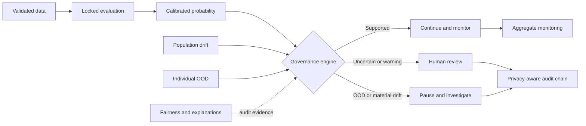

# TrustLens AI

[](https://github.com/akshith2001/trustlens-ai/actions/workflows/tests.yml)
[](https://github.com/akshith2001/trustlens-ai/actions/workflows/codeql.yml)
[](https://github.com/akshith2001/trustlens-ai/actions/workflows/container.yml)
[](LICENSE)
[](pyproject.toml)

Version 0.4.0 · Python 3.11+

**Live research dashboard:**
[trustlens-governance-ai.streamlit.app](https://trustlens-governance-ai.streamlit.app/)

**Research report:**
[TrustLens AI: Human-Governed Machine Learning for Reliability-Aware Risk Classification](reports/TrustLens_AI_Research_Report.pdf)

**One-page research summary:**
[TrustLens AI supervisor brief](reports/TrustLens_AI_One_Page_Research_Summary.pdf)

**Research agenda:**
[`Evidence-Constrained Credit-Risk Decision Support Under Uncertainty`](docs/research_agenda.md)

TrustLens AI is a research prototype for evaluating whether machine-learning
predictions are accurate, calibrated, explainable, and suitable for human
review. The first case study uses historical credit-risk data; a later module
will evaluate computer-vision anomaly detection.

## At a glance

| Evidence | Published result |
|---|---|
| Independent credit-domain validation | 9,871 FICO HELOC records; approximately 0.73 balanced accuracy and 0.80 ROC AUC |
| Locked historical holdout | 0.833 higher-risk recall; weighted error cost reduced from 300 to 123, with 73 false positives |
| Verification | 63 automated tests; 90.08% statement coverage; Tests, CodeQL and container CI |
| Governance | Authenticated API, governed thresholds, drift/OOD screening, human-review rules and chained audit records |
| Reproducibility | Versioned benchmark artifacts, dataset checksums, model registry, experiment ledger, SBOM and citation metadata |
| Intended use | Educational research only; not for real lending or other high-stakes decisions |

## Governance architecture



The predictive model does not make an autonomous decision. Reliability signals
and locked policies determine whether processing may continue, requires human
review, or must pause. See [`docs/architecture.md`](docs/architecture.md) for
the complete methodology and interpretation boundaries.

## Research question

Can a human-governed auditing layer combining cost-sensitive evaluation,
uncertainty estimation, drift detection, and explainability identify unreliable
machine-learning outputs more effectively than confidence scores alone?

## Research contribution

TrustLens is positioned as more than a prediction benchmark. Its central
research contribution is an **evidence contract**: every material model output
should be accompanied by its provenance, uncertainty, limitation, permitted
interpretation and required human action. The proposed research tests whether
this structure helps people recognise when a prediction may be used, deferred
or rejected more reliably than a score or explanation alone.

The next study phase focuses on contemporary external validation, robustness
under population shift and a controlled comparison of three interfaces: score
only, score plus explanation, and the complete evidence contract. See the
[`research agenda`](docs/research_agenda.md) for the questions, hypotheses,
evaluation plan and publication boundaries.

## Current status

The governed tabular research engine is covered by an automated test suite.
Its locked model was evaluated once on a 200-record holdout. It achieved 0.833
higher-risk recall and reduced the predefined weighted error cost from the
majority baseline's 300 to 123, while also producing 73 false positives. See
[`docs/results.md`](docs/results.md) for the complete, limitation-aware report
and [`MODEL_CARD.md`](MODEL_CARD.md) for intended use, governance and risks.
The results report also includes confidence intervals so the small held-out
sample is not presented with false precision.
Post-hoc error-slice diagnostics also show where the locked model failed on its
historical holdout, without using those findings to retune the model.

## Architecture

The project separates model development, locked final evaluation and runtime
governance. See the rendered pipeline and full methodology in
[`docs/architecture.md`](docs/architecture.md).

## Reproducible development benchmark

TrustLens publishes a versioned, machine-readable comparison of declared model
candidates. The benchmark uses only the development partition; it never opens
or reevaluates the locked final holdout.

```bash
trustlens-benchmark --output results/development_benchmark.json
```

The artifact records the dataset checksum, split seed, error-cost definition,
ranking rule, dependency versions, fold count, metric means and standard
deviations. Candidates are ranked by lowest mean weighted error cost, then
highest mean balanced accuracy, with model name as a deterministic tie-breaker.

The controlled robustness suite adds two deterministic synthetic datasets,
paired model-cost comparisons, 95% bootstrap intervals and a documented
covariate-shift stress test:

```bash
trustlens-benchmark-suite
```

Its results are explicitly not external domain validation. They test the
benchmark machinery under controlled linear, nonlinear, balanced, imbalanced
and shifted conditions without making claims about real people or decisions.
The complete predeclared methodology and interpretation boundary are documented
in [`docs/benchmark_protocol.md`](docs/benchmark_protocol.md).

## Public reference benchmark

Version 0.3.0 tests the evaluation machinery on two real, packaged public
datasets and four deterministic model families: logistic regression, calibrated
logistic regression, random forest and histogram gradient boosting. It reports
balanced accuracy, ROC AUC, Brier score, controlled-noise degradation and a
proxy-slice recall gap.

```bash
trustlens-reference-benchmark
```

See [`reports/Reference_Benchmark_Report.md`](reports/Reference_Benchmark_Report.md)
and [`results/reference_benchmark.json`](results/reference_benchmark.json).
These cross-domain datasets check reproducibility and generality of the
benchmark code. They are **not** external credit validation, a clinical study,
or evidence that any model is safe for real decisions.

## Independent credit-domain validation

Version 0.4.0 adds a deterministic five-fold validation on the independent,
CC0-licensed FICO HELOC cleaned dataset (OpenML data ID 45554): 9,871 records
and 23 credit-domain features. Logistic regression and random forest both
achieve approximately 0.73 balanced accuracy and 0.80 ROC AUC. Reproduce it
with `trustlens-external-validation`; see
[`reports/External_Credit_Validation.md`](reports/External_Credit_Validation.md).
The source metadata does not document a collection period, so this is not
claimed as contemporary or temporal validation and does not justify lending use.

## Authenticated governance API and monitoring

The FastAPI service exposes `/health` publicly and protects the governance,
monitoring and model-registry routes with a constant-time `X-API-Key` check.
It fails closed when `TRUSTLENS_API_KEY` is unset. The bounded monitor stores
only aggregate counts and raises drift/OOD-rate alerts; it is an operational
foundation, not evidence from live traffic. The file-backed registry records
artifact checksums, metadata and append-only experiment events.

```bash
set TRUSTLENS_API_KEY=replace-with-a-secret
uvicorn trustlens.api:app --host 0.0.0.0 --port 8501
```

## Run locally or in a container

```bash
python -m pip install -e ".[dev]"
pytest
streamlit run app.py
```

```bash
set TRUSTLENS_API_KEY=replace-with-a-secret
docker compose up --build
```

## Governance audit records

The `trustlens.audit` module creates privacy-aware JSON Lines records that store
a salted input digest rather than raw feature values. Each event commits to the
previous event hash, allowing later verification that the chain was not edited
or reordered. This demonstrates audit mechanics; it is not a production logging
or privacy compliance system.

## Development and citation

See [`CONTRIBUTING.md`](CONTRIBUTING.md) for research-integrity and development
requirements, [`SECURITY.md`](SECURITY.md) for private vulnerability reporting,
and [`CITATION.cff`](CITATION.cff) for citation metadata. Release changes are
recorded in [`CHANGELOG.md`](CHANGELOG.md). TrustLens AI is available under the
[`Apache License 2.0`](LICENSE).

## Safety and scope

This project is an educational research prototype. It must not be used to make
real lending, employment, legal, medical, or security decisions.

## Capability roadmap

- Completed: tabular evaluation, calibration, uncertainty, drift/OOD screening,
  subgroup diagnostics, explainability, human review and chained audit records.
- Completed: synthetic controlled benchmarks, cross-domain public references,
  and independent credit-domain reference validation.
- Completed: authenticated governance API, checksum-backed model registry,
  append-only experiment ledger, aggregate monitoring and alert evaluation.
- Next: prospective contemporary credit validation, external telemetry/alert
  delivery, managed identity/secrets and computer-vision anomaly detection.

## Dataset

The first case study uses the UCI South German Credit dataset:
https://doi.org/10.24432/C5QG88

The dataset contains 1,000 historical records from 1973--1975. Its age,
sampling design, and limited demographic encoding are material limitations and
will be treated as audit findings rather than hidden.

The loader verifies the downloaded archive against its locked SHA-256 digest
before parsing it. This prevents an upstream change or corrupted cache from
silently altering the published experiment.

