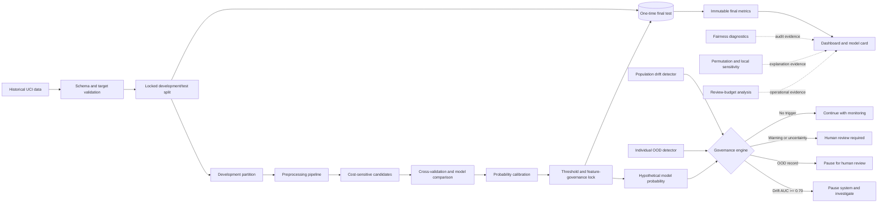

# System architecture and methodology

## Purpose

TrustLens AI separates prediction from governance. A model score is never
treated as a complete decision: calibration, population shift, individual
out-of-distribution status and locked escalation rules determine whether the
system may continue, must request human review, or must pause.

## Architecture

The dashboard simulator uses hypothetical signals to expose the governance
engine. It does not run the historical model or assess a person.

## Experimental protocol

### 1. Data contract

The loader retrieves the official South German Credit archive, validates the
expected 20-column feature schema, maps the source target to
`0 = lower risk` and `1 = higher risk`, and checks the class counts. Raw data
are cached locally but excluded from Git because the loader is reproducible.

### 2. Locked data split

A stratified 20% final partition is isolated before model development. All
model comparison, calibration, feature removal and threshold selection use the
remaining development data. The final-evaluation script refuses to overwrite
an existing result file, making accidental repeated test-set tuning harder.

### 3. Model comparison

The project compares a majority baseline, logistic regression,
cost-sensitive logistic regression, cost-sensitive random forest and
cost-sensitive histogram gradient boosting. Five-fold stratified
cross-validation reports balanced accuracy, higher-risk precision, recall, F1
and a predefined weighted error cost.

The cost function assigns five units to a false negative and one unit to a
false positive. This is an experimental choice for studying asymmetric error
trade-offs, not a claim about real stakeholder preferences.

### 4. Governed model selection

The selected governed configuration is a cost-sensitive random forest with
sigmoid probability calibration. The ambiguous `personal_status_sex` and
`foreign_worker` fields are excluded from prediction. The threshold is locked
at 0.20 using development evidence.

Model selection does not optimize one metric in isolation. Recall, precision,
balanced accuracy, calibration and weighted error cost are reported together.

### 5. Reliability layers

- **Calibration:** Brier score, log loss and expected calibration error assess
  whether probabilities behave like probabilities.
- **Population drift:** adversarial validation tests whether a classifier can
  distinguish reference and comparison samples. AUC of 0.70 or above pauses
  the system for investigation.
- **Individual OOD:** an Isolation Forest fitted to robust numerical features
  flags records outside the supported region and routes them to review.
- **Human-review policy:** ranked review budgets estimate coverage, captured
  errors and potential cost reduction without assuming perfect reviewers.

### 6. Fairness and explainability

Age-band and recorded foreign-worker-code diagnostics report group size,
observed warning rate, recall and false-positive rate with Wilson confidence
intervals. These outputs are exploratory and cannot prove fairness,
discrimination or causation. Gender fairness is marked not assessable because
the source combines personal status and sex.

Permutation importance measures average performance dependence. Local feature
perturbations measure model sensitivity around one record. Neither produces
causal explanations or valid recourse advice.

### 7. Final evaluation

The locked model is evaluated once on 200 held-out records. The result is
stored as JSON and used to generate the published figure and dashboard metrics.
The lower final performance relative to development is reported as a
generalisation gap rather than followed by test-set retuning.

## Verification strategy

The automated test suite covers data validation, metric calculation,
preprocessing, calibration, drift, OOD, fairness summaries, explanations,
review policy, governance precedence and the one-time final evaluation guard.
GitHub Actions runs the suite on Python 3.11 and 3.13 for every push and pull
request to `main`.

## Decision boundaries

| Signal | Locked response |
|---|---|
| Drift AUC >= 0.70 | Pause system and investigate |
| Individual OOD flag | Pause for human review |
| Probability within +/-0.05 of threshold | Human review required |
| Probability above threshold | Human review required |
| No reliability trigger | Continue with monitoring and audit logs |

Population-level drift has precedence over record-level signals. OOD status
has precedence over the predicted probability. These rules prevent a
confident-looking score from overriding a known reliability failure.

## Current boundary of the research

The architecture demonstrates disciplined experimentation and governance on a
small historical dataset. It does not include external validation, a
prospective study, deployment telemetry, real reviewers or evidence that its
cost ratio represents affected stakeholders. Those are prerequisites for any
future operational study, not optional finishing touches.

